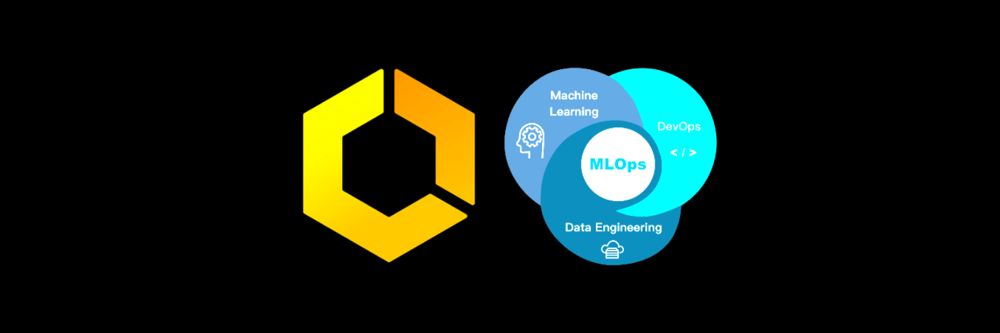

# ECS MLOps

<!-- PROJECT LOGO -->
<br />
<p align="center">
  <a href="https://github.com/dao-duc-tung/ecs-mlops">
    
  </a>

  <h3 align="center">ECS MLOps</h3>
</p>

<!-- TABLE OF CONTENTS -->
<details open="open">
  <summary>Table of Contents</summary>
  <ol>
    <li><a href="#introduction">Introduction</a></li>
    <li><a href="#architecture">Architecture</a></li>
    <li><a href="#create-endpoint-a">Create Endpoint A</a></li>
    <li><a href="#add-endpoint-b">Add Endpoint B</a></li>
    <li><a href="#miscellaneous">Miscellaneous</a></li>
    <li><a href="#cleanup">Cleanup</a></li>
    <li><a href="#license">License</a></li>
    <li><a href="#contact">Contact</a></li>
  </ol>
</details>

## Introduction

This is a sample solution to build a completed MLOps pipeline in production for a typical ML system. This example could be useful for any engineer or organization looking to operationalize ML with native AWS development tools such as CodePipeline, CodeBuild, and ECS.

The main use-case of this sample solution is:

1. Your team wants to deploy infrastructure for an ML endpoint of an ML system. Let's call this endpoint `A`.
1. After that, your team wants to deploy another ML endpoint of the same ML system into the existing infrastructure. Let's call this endpoint `B`.

## Architecture

In the following diagram, you can view the continuous delivery stages of the system.

1. Developers push code to trigger the CodePipeline
1. The CodePipeline runs CodeBuild job to run the CloudFormation templates to create resources (first time running) or update resources (second time running)

![architecture][architecture]

### Component Details

- **CodePipeline**: has various stages that define which step through which actions must be taken in which order to go from source code to creation of the production resources.
- **CodeBuild**: builds the source code from GitHub and runs CloudFormation templates.
- **CloudFormation (CF)**: creates resources using YAML template.
- **Elastic Container Registry (ECR)**: stores docker images.
- **Elastic Container Service (ECS)**: groups container instances on which we can run task requests.
- **Elastic File System (EFS)**: stores user request's data and model's weights.
- **Application Load Balancer (ALB)**: distributes incoming application traffic across multiple target groups in ECS across Availability Zones. It monitors the health of its registered targets and routes traffic only to the healthy targets.
- **Route 53**: connects user requests to infrastructure running in AWS, in our case, the ALB. In this project, we use another domain provider to route the traffic at the domain level.
- **AWS Certificate Manager (ACM)**: provisions, manages, and deploys public and private Secure Sockets Layer/Transport Layer Security (SSL/TLS) certificates for use with AWS services.
- **Virtual Private Cloud (VPC)**: controls our virtual networking environment, including resource placement, connectivity, and security.
- **CloudWatch**: collects monitoring and operational data in the form of logs, metrics, and events.
- **Simple Notification Service (SNS)**: manages messaging service for both application-to-application (A2A) and application-to-person (A2P) communication. In this project, we don't configure SNS.

## Create Endpoint A

Creating the infrastructure for endpoint A has several steps:

1. Create the CloudFormation stack
1. Create CodePipeline and CodeBuild projects
1. Validate resources' permission and states
1. Upload model's weights

This infrastructure is reusable for the other endpoint.

### 1.1. Create CloudFormation Stack

The CloudFormation stack creates the ECR repository. The CodePipeline and CodeBuild that we will create in the later steps depend on this ECR repository.

1. Set parameter `DesiredCount` in `cf_templates/create-ep-a.json` to 0 to avoid the error `docker image is not ready` when the CloudFormation stack is created, because at the time the stack is created, the ECR repository doesn't exist. Set other parameters as well.
1. Run
   ```bash
   aws cloudformation create-stack --stack-name=create-ep-a --template-body file://cf_templates/create-ep-a.yaml --parameters file://cf_templates/create-ep-a.json --capabilities CAPABILITY_NAMED_IAM
   ```

### 1.2. Create CodePipeline and CodeBuild projects

This step creates manually CodePipeline and CodeBuild projects. In the next version of this tutorial, this step should be defined in a CloudFormation template.

1. Update `buildspec/ep-a.yaml` file and push the code
1. Go to AWS Console > CodePipeline > Create a new pipeline
1. Configure pipeline settings

   - Pipeline name: `ep-a`
   - Select `New service role`

1. Add source stage

   - Connect to GitHub, select repository and branch name
   - Enable `Start the pipeline on source code change`
   - Output artifact format: `Full clone`

1. Add build stage

   - Build provider: `AWS CodeBuild`
   - Select your region
   - Create a CodeBuild project with the following settings:
   - Project name: `ep-a`
   - Environment:
     - System: `Ubuntu`
     - Runtime: `Standard`
     - Image: `standard:4.0`
     - Environment type: `Linux`
     - Privileged: `Enabled`
     - Create a new service role
     - Buildspec: use a buildspec file
     - Buildspec name: `./buildspec/ep-a.yaml`
   - Build type: `Single build`

1. Skip deploy stage
1. Review and create CodePipeline

### 1.3. Validate resources

#### 1.3.1. Add GitClone permission to CodeBuild project

Follow the section `Add CodeBuild GitClone permissions for connections to Bitbucket, GitHub, or GitHub Enterprise Server` at [this link](https://docs.aws.amazon.com/codepipeline/latest/userguide/troubleshooting.html#codebuild-role-connections).

#### 1.3.2. Validate API Health Check path

Make sure the health check path parameter in `cf_templates/create-ep-a.json` is correct.

#### 1.3.3. Validate ECS's instances permission to access EFS

Manually add the ECS task's security group of the endpoint A to the Inbound rules of the security group created for EFS shared volumes. Without this, the ECS's instances cannot access EFS shared volumes. Check [this article](https://forums.aws.amazon.com/thread.jspa?threadID=321135) for more detail.

This step can be automated by creating an AWS Lambda function to run the validation task.

### 1.4. Update CloudFormation stack

1. Set parameter `DesiredCount` in `cf_templates/create-ep-a.json` to the expected value.
1. Set parameter `APITag` to the latest git commit hash in the "master" branch.
1. Update stack. This might take ~10m.

   ```bash
   aws cloudformation update-stack --stack-name=<stack-name> --template-body file://cf_templates/create-ep-a.yaml --parameters file://cf_templates/create-ep-a.json --capabilities CAPABILITY_NAMED_IAM
   ```

1. Validate resources
   - ECS: check services, tasks, instances, instances' logs
   - CloudFormation: check created resources, stack status

### 1.5. Upload model's weights

1. Create an S3 folder like `s3://<bucket-name>/<folder-name>`
1. Upload model's weights to this folder
1. Mount the EFS shared weights folder to an EC2 bastion instance (check section `Miscellaneous` below for the instruction of creating this EC2 instance). Check CloudFormation stack's resources for the EFS shared volume's ID
1. Run `s3 sync`
   ```bash
   sudo aws s3 sync s3://<bucket-name>/<folder-name> /mnt/<MOUNTED_FOLDER> --delete
   ```
1. Add the command above as the `cronjob` of `sudo` user
   ```bash
   sudo crontab -e
   # Add this line to perform synchronization every 3rd minute of hour
   */3 * * * * aws s3 sync s3://<bucket-name>/<folder-name> /mnt/<MOUNTED_FOLDER> --delete
   ```

### 1.6. Test endpoint

1. Go to the domain service provider (or Route 53), add the expected record (eg. `HostHeaderApi` parameter in `cf_templates/create-ep-a.json`) to point to the DNS name of the ALB created by the CloudFormation stack
1. Test the API by sending a request to the expected URL
1. Mount the shared assets EFS folder to the EC2 bastion instance to validate if the data is stored correctly

## Add Endpoint B

Adding endpoint B into the existing infrastructure has similar steps as creating the infrastructure for endpoint A.

### 2.1. Create CloudFormation stack

1. Set parameter `DesiredCount` in "cf_templates/add-ep-b.json" to 0.
1. Set parameter ListernerRulePriority to the `latest priority + 1` given that the `latest priority` in the ALB is currently in use
1. Run
   ```bash
   aws cloudformation create-stack --stack-name=add-ep-b --template-body file://cf_templates/add-ep-b.yaml --parameters file://cf_templates/add-ep-b.json --capabilities CAPABILITY_NAMED_IAM
   ```

### 2.2. Create CodePipeline and CodeBuild projects

This step is similar to section `1.2. Create CodePipeline and CodeBuild projects`. For the `buildspec` file, just clone `buildspec/ep-a.yaml` file for the endpoint B.

### 2.3. Validate resources

This step is similar to section `1.3. Validate resources`.

### 2.4. Update CloudFormation stack

This step is similar to section `1.4. Update CloudFormation stack`.

### 2.5. Upload model's weights

This step is similar to section `1.5. Upload model's weights`.

### 2.6. Test endpoint

This step is similar to section `1.6. Test endpoint`.

## Miscellaneous

### Update CloudFormation template for future changes

In the future, when you want to update and validate the CloudFormation template without triggering the CodePipeline either manually or automatically, follow these steps:

1. Set the `APITag` parameter in the parameter JSON file to the latest git commit hash in the master branch.
1. Run `aws cloudformation update-stack` command.
1. After confirming the template is usable, discard the changes of the `APITag` parameter in the parameter JSON file and commit the rest of the changes.

### Access container in Fargate/EC2 instance using ECS Exec

Sometimes you might want to access the containers in Fargate/EC2 instances for debugging purposes. Follow these below instructions to do it. Read [this article](https://aws.amazon.com/blogs/containers/new-using-amazon-ecs-exec-access-your-containers-fargate-ec2/) for more information.

1. [Install SSM](https://docs.aws.amazon.com/systems-manager/latest/userguide/session-manager-working-with-install-plugin.html)
1. Make sure the ECS Task Role allows these actions:
   ```bash
   "ssmmessages:CreateControlChannel"
   "ssmmessages:CreateDataChannel"
   "ssmmessages:OpenControlChannel"
   "ssmmessages:OpenDataChannel"
   ```
1. Make sure `EnableExecuteCommand` is true in the `AWS::ECS::Service` resource in the CloudFormation template.
   - If you haven't set it, then set it to true, and update the cloudformation stack
   - Manually stop all the tasks run by your ECS Service
   - Wait until the new tasks are deployed
1. Run this command to `exec` into the container.
   ```bash
   aws ecs execute-command --cluster <ecs-cluster> --task <TASK ID> --command "/bin/bash" --interactive
   ```

### Mount the EFS shared volume on the EC2 bastion instance

The purpose of mounting the EFS shared volume is to manipulate the saved data. Follow these below instructions. Read [this article](https://docs.aws.amazon.com/efs/latest/ug/wt1-test.html) for more detail.

1. Add your IP into the Inbound Rules of the Security Group of the EC2 bastion instance
1. Ask your Admin to get the `.pem` file to SSH to the EC2 bastion instance
1. Make sure the NFS client is installed on the EC2 instance
1. Create a directory to mount the EFS shared volume to
   ```bash
   sudo mkdir /mnt/new-folder
   ```
1. Go to AWS Console > EFS to get the correct EFS file system ID of the EFS shared volume
1. Run
   ```bash
   sudo mount -t nfs -o nfsvers=4.1,rsize=1048576,wsize=1048576,hard,timeo=600,retrans=2,noresvport <efs-file-system-id>.efs.<region>.amazonaws.com:/ /mnt/new-folder
   ```
1. Validate the mount point
   ```bash
   df -aTh
   ```

## Cleanup

1. Remove the record that points to the ALB's DNS name in your domain service.
1. Delete all related S3 buckets.
1. Delete CodePipeline and CodeBuild projects
1. Delete all the CF stacks one by one starting from the top one. Don't delete them all at once.

## License

Distributed under the MIT License. See [LICENSE](LICENSE) for more information.

## Contact

Tung Dao - [LinkedIn](https://www.linkedin.com/in/tungdao17/)

Project Link: [https://github.com/dao-duc-tung/ecs-mlops](https://github.com/dao-duc-tung/ecs-mlops)

<!-- MARKDOWN LINKS & IMAGES -->

[architecture]: /assets/architecture.png
